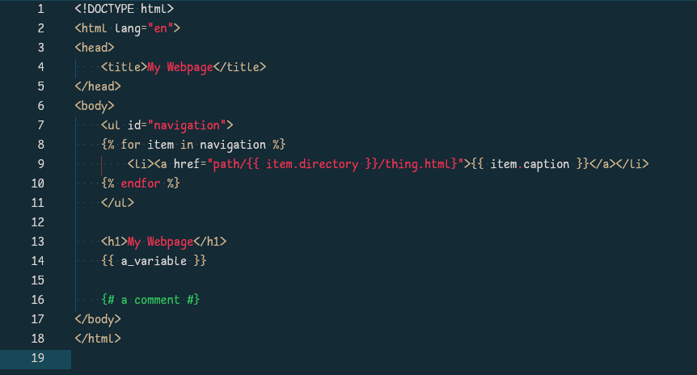
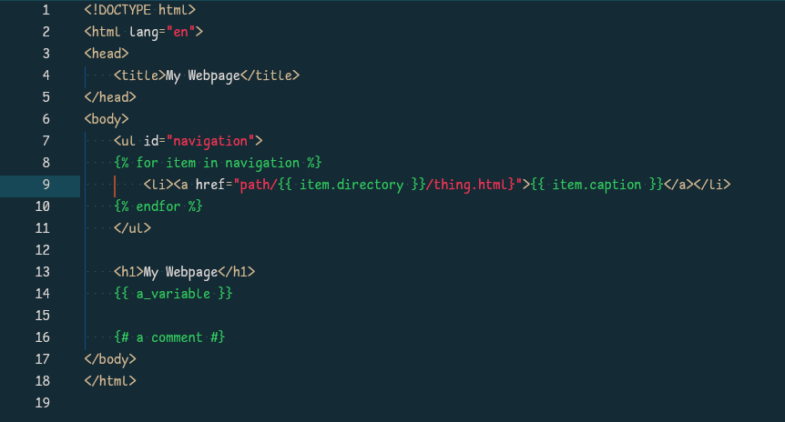
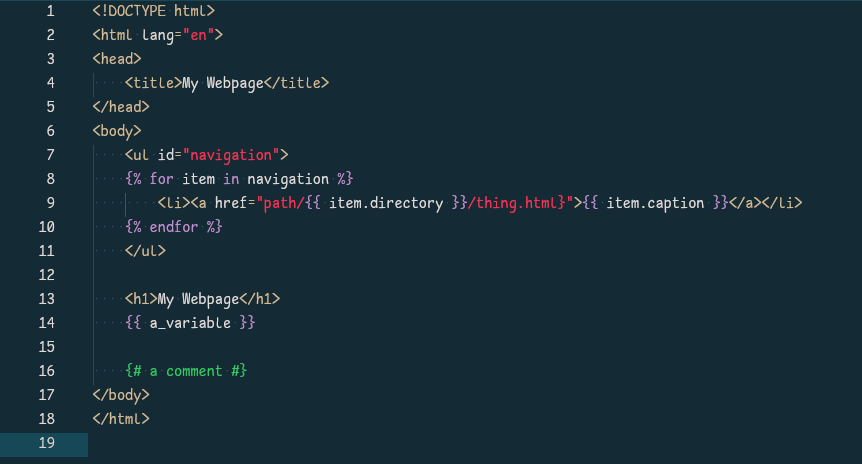

# HTML-Jinja

Ad-hoc apporach to highlighting HTML-Jinja templates. Uses HTML as the core language and injections for Jinja highlighting.

## Captures

```
; We consider everything "preprocessor" since that's the closest existing capture to what a jinja block is.
; Everything is suffixed with "preproc." in order to allow the user to highlight them all together as a whole,
; or highlight captures separately, as desired.

; Captures:
; @preproc                          - default
; @preproc.string                   - strings
; @preproc.number.[float.]          - numbers
; @preproc.boolean                  - booleans
; @preproc.comment                  - comments
; @preproc.punctuation.delimiter    - ",.:"
; @preproc.punctuation.bracket      - "()[]<>"
; @preproc.variable                 - all variables/parameters
; @preproc.function                 - functions
; @preproc.keyword                  - all keywords/builtins
; @preproc.keyword.directive        - "{{", "}}", and other block delimiters
```

## Alternatives

See [this extension](https://github.com/ArcherHume/jinja2-support) for a more appropriate approach. It uses Jinja as the core language and injections for HTML highlighting, which is the correct and scalable way to approach this. However in its current state it makes several highlighting mistakes and its captures are not highlight-able as a whole (see below).

jinja2-support


html-jinja (highlighted as a whole)

```json
"preproc": {
  "color": "#34cb62",
  "font_style": null,
  "font_weight": null
},
"preproc.string": {
  "color": "#34cb62",
  "font_style": null,
  "font_weight": null
},
"preproc.number": {
  "color": "#34cb62",
  "font_style": null,
  "font_weight": null
},
"preproc.number.float": {
  "color": "#34cb62",
  "font_style": null,
  "font_weight": null
},
"preproc.boolean": {
  "color": "#34cb62",
  "font_style": null,
  "font_weight": null
},
"preproc.comment": {
  "color": "#34cb62",
  "font_style": null,
  "font_weight": null
},
"preproc.punctuation.delimiter": {
  "color": "#34cb62",
  "font_style": null,
  "font_weight": null
},
"preproc.punctuation.bracket": {
  "color": "#34cb62",
  "font_style": null,
  "font_weight": null
},
"preproc.variable": {
  "color": "#34cb62",
  "font_style": null,
  "font_weight": null
},
"preproc.function": {
  "color": "#34cb62",
  "font_style": null,
  "font_weight": null
},
"preproc.keyword": {
  "color": "#34cb62",
  "font_style": null,
  "font_weight": null
},
"preproc.keyword.directive": {
  "color": "#34cb62",
  "font_style": null,
  "font_weight": null
},
```

html-jinja (highlighted individually)

```json
"preproc": {
  "color": "#dfdfdf",
  "font_style": null,
  "font_weight": null
},
"preproc.string": {
  "color": "#dfdfdf",
  "font_style": null,
  "font_weight": null
},
"preproc.number": {
  "color": "#dfdfdf",
  "font_style": null,
  "font_weight": null
},
"preproc.number.float": {
  "color": "#dfdfdf",
  "font_style": null,
  "font_weight": null
},
"preproc.boolean": {
  "color": "#dfdfdf",
  "font_style": null,
  "font_weight": null
},
"preproc.comment": {
  "color": "#34cb62",
  "font_style": null,
  "font_weight": null
},
"preproc.punctuation.delimiter": {
  "color": "#dfdfdf",
  "font_style": null,
  "font_weight": null
},
"preproc.punctuation.bracket": {
  "color": "#dfdfdf",
  "font_style": null,
  "font_weight": null
},
"preproc.variable": {
  "color": "#dfdfdf",
  "font_style": null,
  "font_weight": null
},
"preproc.function": {
  "color": "#dfdfdf",
  "font_style": null,
  "font_weight": null
},
"preproc.keyword": {
  "color": "#be93d4",
  "font_style": null,
  "font_weight": null
},
"preproc.keyword.directive": {
  "color": "#be93d4",
  "font_style": null,
  "font_weight": null
},
```
